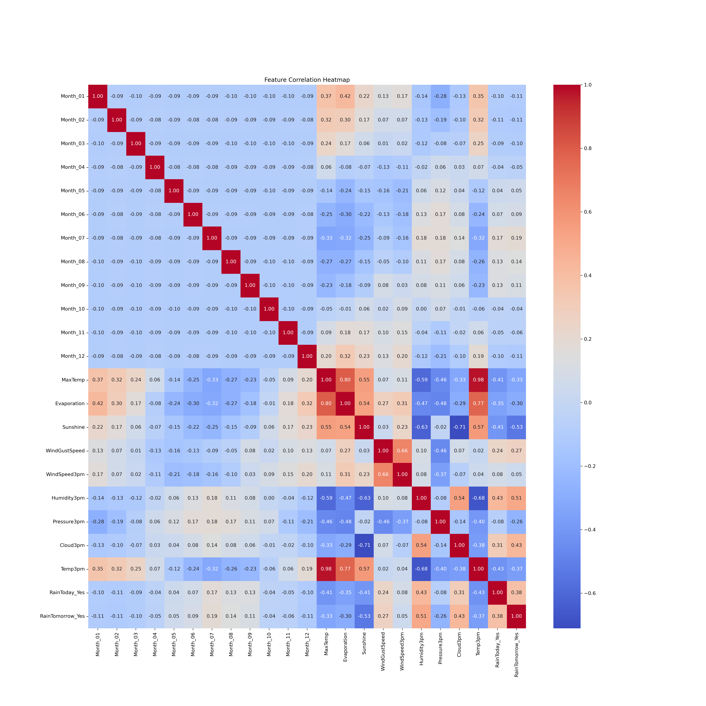
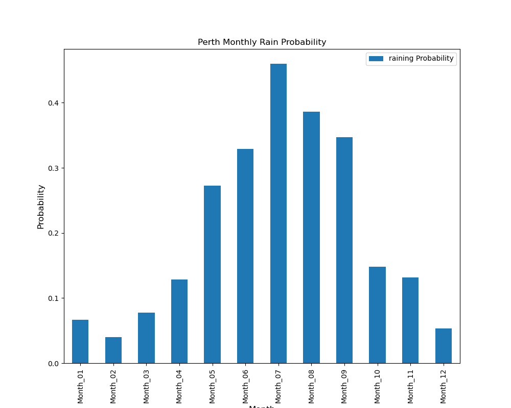
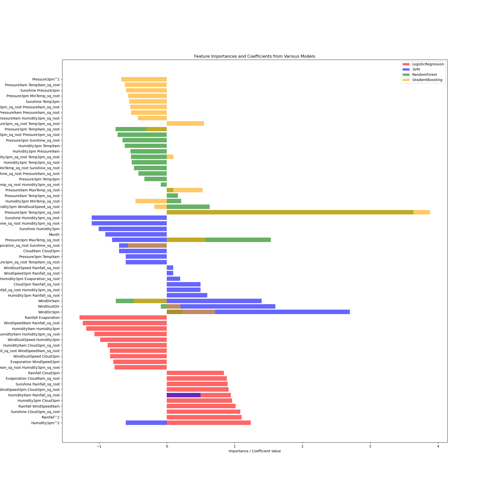

# ML-AI-Weather

## Overview

My dataset is from Kaggle: https://www.kaggle.com/datasets/arunavakrchakraborty/australia-weather-data

It is weather data for Australia, contains about 10 years of daily weather observations from many locations across Australia. It's suitable for developing a classifier to predict the next-day rain on the target variable RainTomorrow.

Weather forecasting is very important in modern life, it affects people’s personal and business decisions in many ways. On top of that I have been always interested in knowning what factors affect weather in which way, it's exciting to learn some techniques to do my own weather forecast.

I follow CRISP-DM for this project.

I will build a model for the whole Australia and build separate models for Sydney and Perth, to see how models of the same kind (e.g. LogisticRegression) perform in different datasets.
I will use visualization in for both data analysis and model comparisons, specifically feature correlation heapmap is used to examine the dataset and believed to be quite useful.

The model is also compared to the DummyClassifier and the "common windom" approach by guessing tomorrow's weather is the same as today's.

### Initial Report

This initial report include typical data understanding, data preparation, visualization and a LogisticRegression model.

## Data Understanding

- Examine the dataset with DataFrame functionsd like .info(), .describe(), .sample(), .value_counts()...

## Data Preparation

- Drop entries with NaN value
- Modifiy the column "Date" from value like 2017-06-23 to "06", basically keep the month info.
- OneHot encoding for categorical features
- PolynomialFeature() with degree=2 for numerical features

## Data Analysis and simple model

This includes typical data understanding, data preparation, visualization and a simple LogisticRegression model.
Besides operation like .dropna() to remove NaN entries, two useful steps are used:
1. Convert Celsius to Kelvin, Kelvin is the system that directly related to thermodynamics, it's a much better farmework for any scientic projects.
2. The full date info like 2017-06-22 probably isn't useful for weather forecasting. I never heard anyone used weather info of specific dates in the past to do forecast. However month is a useful piece of data, November in Chicago or July in London both provide significant amount of info. The full date format is processed to become month only like 03, 12 for March and December.

A dumb person's forecast is put to test, which simply predicts tomorrow's weather is same as today's, and it performs close to the dummy model which predicts the majority class all the time.

Heapmaps are informative, I observed Pressure has strong negative correlation with RainTomorrow, Humidity and Cloud have string positive correlatioin with RainTomorrow, also as expected RainToday also have strong correlation with RainTomorrow.
Raining days per month Barcharts of Sudney and Perth clearly shows they have very different climate across the year.

The following is the heapmap for months + numerical features, temperature, humidity and rain have correlations with months, numerical features also have correlations within themselves.
 

 
Perth has a typical mediterranean climate, very dry in the summer(southern hemisphere) and wet in the winter

## Modeling

- Create and fit a DummyClassifier for the whole Australia
- Create and fit a LogisticRegression Classifier for the whole Australia
- Create and fit a LogisticRegression Classifier for Sydney
- Create and fit a LogisticRegression Classifier for Perth
- Create confusion matrix for all these models for comparison
- Create DataFrames for coefficients of the LogisticRegression models, for inteprettion and comparison

## Subsequent Improvements

- Further feature engineering, e.g. craate features of square root values for numerical features
- Create models with DecisionTree, KNN, SVC and ensemble classifiers
- Apply grid search on model hyperperameters
- Additional visualization

## Model Comparison and Analysis

I chose different models for the city Perth as the target for comparison because overall Perth models have better performance than Sydney and the whole Australia.
I then focused on LogisticRegression, SVM, RandomForest and GradientBoostingfor this final comparison and analysis although I also tried DecisionTree and KNN in my Jupyter notebook. The 4 chosen models have better performance.

Confusion matrix is used throughout the project. Besides accuracy, precision, recall and specificity I defined a custom measurement as:

**custom = recall * 0.6 + specificity * 0.4**

Like many apppliactions, I don't think accuracy is the best metric for this weather prediction project. High recall (avoid missing a rainly day) and high specificity (avoid missing a sunny day) are more important beause it is annoying or even frustrating to have a wrong prediction. People do not have rain gears rain cloths ready when the forecast misses a raining day, while people may cancel their activities or trips unneceaasrily if the forecast misses a sunny day.
I gave recall highter weight because I think it is more troublesome to miss a raining day.

There are 4 tables, one for each model type. Entries in a table correspond to different parameters/setups of the same model, here is some examples:

- "LogisticRegression Base Perth", the Base LogisticRegression regression from the initial report, before converting temperature to Kelvin based, before adding square root values for numerical features
- "LogisticRegression Perth T03", use custom prediction threshold 0.3 instead of the default 0.5
- "SVM Perth Target T03", SVM model with TargetEncoder and custom threshold 0.3
- "RandomForest Perth Target Balanced T03", RandomForest model with TargetEncoder, class_weight='balanced' and custom threshold 0.3
 
 

Looking at accuracy, the following all pretty good (> 0.9) and similar number:

- LogisticRegression Perth: 0.904888
- LogisticRegression Perth Target: 0.908851
- SVM Perth: 0.906209
- RandomForest Perth Balanced: 0.907530
- GradientBoosting Perth: 0.908851

We also see custom threshold of 0.3 consistently improves recall but impacts specificity across all models, as expected.

Switching to the custom metric, 
- **"SVM Perth Balanced"** and **"SVM Perth Target Balanced"** stand out with	0.881110 and 0.885651
- followed by **"RandomForest Perth Target T03"** and **"RandomForest Perth T03"** with 0.869355 and 0.860901
- several LogisticRegression models also do well (> 0.85)

I also observed:
- models with **class_weight='balanced'** perform better for LogisticReGression and SVM, but RandomForest models have the opposite that models **without** class_weight='balanced' do better
- switching to **TargetEncoder** does help for most models, e.g. "RandomForest Perth Balanced T03" vs "RandomForest Perth Target Balanced T03" with	0.844553 and 0.858966 or "LogisticRegression Perth Balanced T03" vs "LogisticRegression Perth Target Balanced T03" with 0.857889 and 0.868329.
 

 
 

**LogisticRegression Models**

model	| accuracy	| precision	| recall	| specificity	| custom
--- | --- | --- | --- | --- | --- 
LogisticRegression Base Perth	| 0.904888 | 0.768212	| 0.758170	| 0.942053	| 0.831723
LogisticRegression Perth	| 0.904888	| 0.768212	| 0.758170	| 0.942053	| 0.831723
LogisticRegression Perth T03	| 0.881110	| 0.672131	| 0.803922	| 0.900662	| 0.842618
LogisticRegression Perth Balanced	| 0.867900	| 0.630542	| 0.836601	| 0.875828	| 0.852292
LogisticRegression Perth Balanced T03	| 0.833554	| 0.555556	| 0.882353	| 0.821192	| 0.857889
LogisticRegression Perth Target	| 0.908851	| 0.780000	| 0.764706	| 0.945364	| 0.836969
LogisticRegression Perth Target T03	| 0.887715	| 0.684783	| 0.823529	| 0.903974	| 0.855707
LogisticRegression Perth Target Balanced	| 0.870542	| 0.635468	| 0.843137	| 0.877483	| 0.856876
LogisticRegression Perth Target Balanced T03	| 0.834875	| 0.556452	| 0.901961	| 0.817881	| 0.868329
 
 

**SVM Models**

model	| accuracy	| precision | recall	| specificity	| custom
--- | --- | --- | --- | --- | --- 
SVM Perth	| 0.906209	| 0.810606	| 0.699346	| 0.958609	| 0.803052
SVM Perth T03	| 0.887715	| 0.688889	| 0.810458	| 0.907285	| 0.849188
SVM Perth Balanced	| 0.882431	| 0.653846	| 0.888889	| 0.880795	| 0.885651
SVM Perth Balanced T03	| 0.881110	| 0.663212	| 0.836601	| 0.892384	| 0.858914
SVM Perth Target	| 0.902246	| 0.780142	| 0.718954	| 0.948675	| 0.810843
SVM Perth Target T03	| 0.885073	| 0.685393	| 0.797386	| 0.907285	| 0.841345
SVM Perth Target Balanced	| 0.881110	| 0.650718	| 0.888889	| 0.879139	| 0.884989
SVM Perth Target Balanced T03	| 0.886394	| 0.677249	| 0.836601	| 0.899007	| 0.861563
 
 

**RandomForest Models**

model	| accuracy	| precision	| recall	| specificity	| custom
--- | --- | --- | --- | --- | --- 
RandomForest Perth	| 0.899604	| 0.781022	| 0.699346	| 0.950331	| 0.799740
RandomForest Perth T03	| 0.885073	| 0.673684	| 0.836601	| 0.897351	| 0.860901
RandomForest Perth Balanced	| 0.907530	| 0.826772	| 0.686275	| 0.963576	| 0.797195
RandomForest Perth Balanced T03	| 0.878468	| 0.663102	| 0.810458	| 0.895695	| 0.844553
RandomForest Perth Target	| 0.904888	| 0.787234	| 0.725490	| 0.950331	| 0.815427
RandomForest Perth Target T03	| 0.882431	| 0.661616	| 0.856209	| 0.889073	| 0.869355
RandomForest Perth Target Balanced	| 0.904888	| 0.809160	| 0.692810	| 0.958609	| 0.799130
RandomForest Perth Target Balanced T03	| 0.887715	| 0.682796	| 0.830065	| 0.902318	|0.858966
 
 

**GradientBoosting Models**

model	| accuracy	| precision	| recall	| specificity| custom
--- | --- | --- | --- | --- | --- 
GradientBoosting Perth	| 0.908851	| 0.795775	| 0.738562	| 0.951987	| 0.823932
GradientBoosting Perth T03	| 0.891678	| 0.720497	| 0.758170	| 0.925497	| 0.825101
GradientBoosting Perth Target	| 0.910172	| 0.797203	| 0.745098	| 0.951987	| 0.827854
GradientBoosting Perth Target T03	| 0.898283	| 0.734568	| 0.777778	| 0.928808	| 0.838190
 
 

## Feature importances
These info are collected from 4 models with TargetEncoder but without class_weight='balanced', e.g. RandomForest Perth Target and LogisticRegression Perth Target.
I see 4 models mostly have different features as important ones, only a small number of features are included in 2 models, probably because they use very different algorithms in training.

The jupyter file is weatherAUS.ipynb

## Appendix

